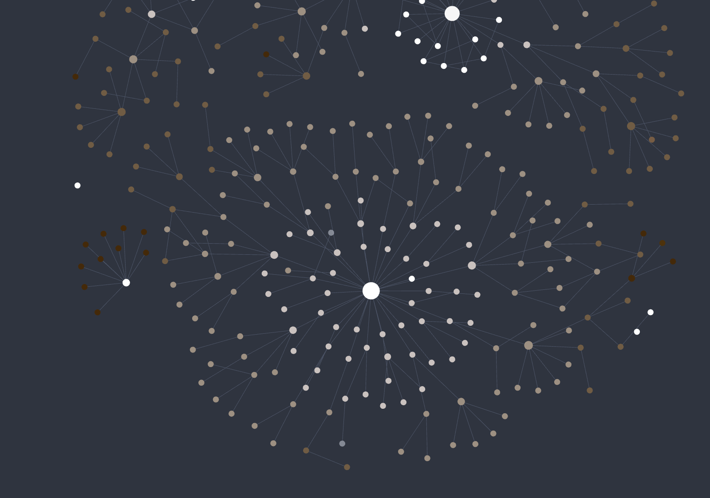

# Graph Depth Gradient

An Obsidian plugin that colors **graph view** nodes by their **folder depth**, as a gradient between two colors — applied independently per top-level section, so each section's root note looks one color and its deepest notes fade toward another. Defaults to a neutral (achromatic) gradient.

## How depth is measured

Each node is colored by how deep its file sits in the folder tree — simply the number of parent folders in its path:

- `note.md` → depth `0`
- `area/note.md` → depth `1`
- `area/topic/sub/note.md` → depth `3`

The gradient is applied **per top-level section** (the first folder in the path). Within each section the depth range is detected dynamically: the **shallowest** note (the section's root) gets the **start color**, the **deepest** descendant gets the **end color**, and depths in between are interpolated linearly. So every section spans the full start→end range regardless of how deep it actually goes — a shallow section like `블로그/` still fades all the way from start to end, and a deep section like `개발/` distributes the gradient across more levels. Files at the vault root (depth `0`, no folder) form their own section and take the start color. Notes that aren't files in the vault (tags, attachments-less/unresolved nodes) keep their original color.

This is stable and independent of which note is selected — the coloring reflects your folder structure, not the active note.

## How the color is applied

The plugin sets each node's color on the graph renderer directly and refreshes when the vault changes.

> Because it overrides node colors, this plugin is **mutually exclusive with other graph node-coloring plugins** (including Obsidian's Graph color groups for the affected nodes, and any other recoloring plugin). A graph node can only hold one color at a time, so run one coloring scheme at a time. It does **not** conflict with non-coloring plugins (panning, layout, etc.). Disabling the plugin restores the original colors.

Works in both the global **Graph view** and the **Local graph**.

## Settings

- **Start color (section root)** — color for each section's shallowest note (its root). Default: achromatic (white).
- **End color (deepest)** — color for each section's deepest note. Default: achromatic (dark gray).

## Notes

This plugin draws into the graph view's internal renderer (setting per-node colors). It relies on internal renderer APIs that are not part of the public plugin API and may change in future Obsidian versions. It is desktop-only.

## License

[MIT](LICENSE)
